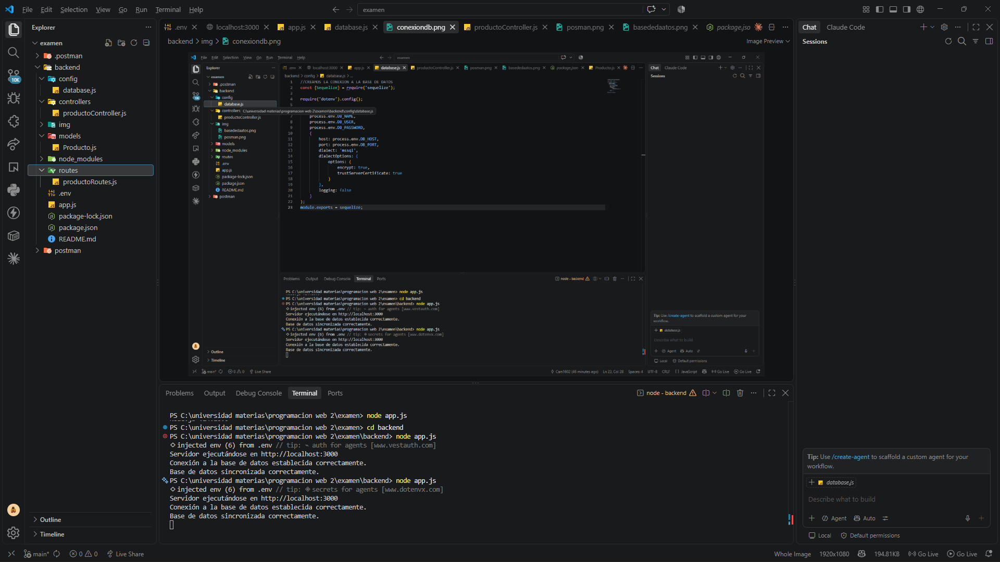
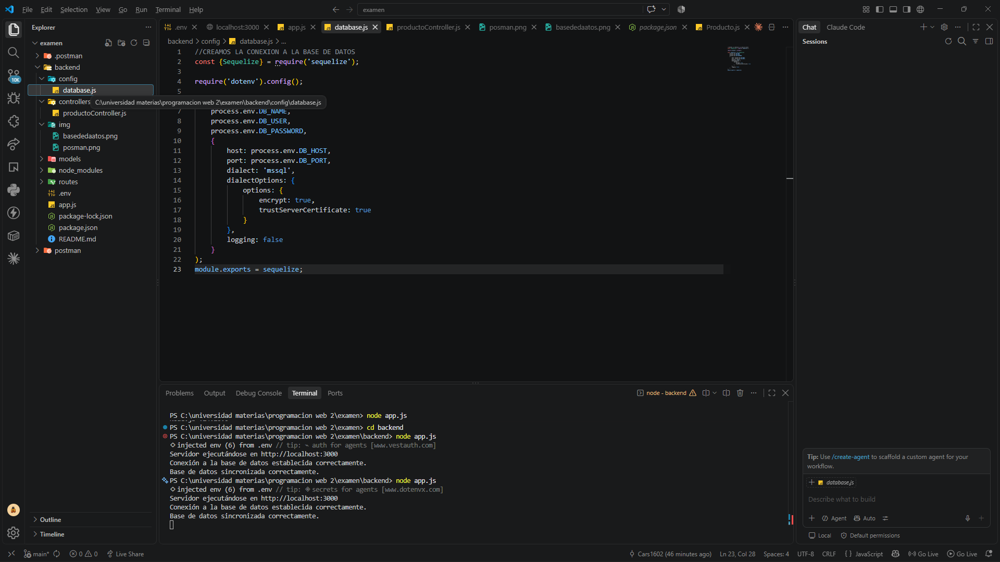
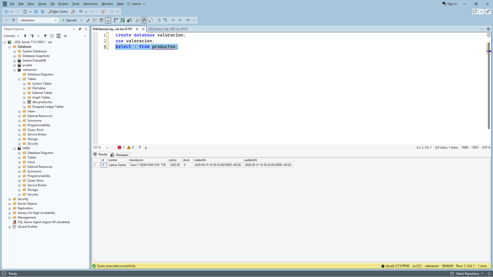
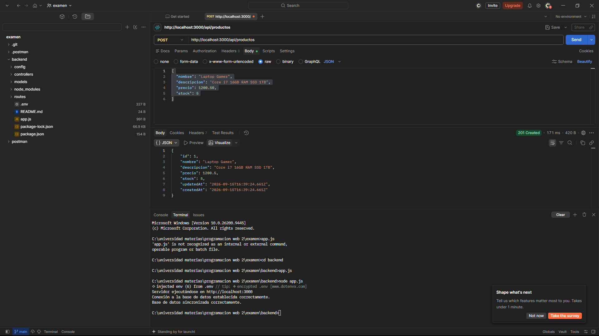
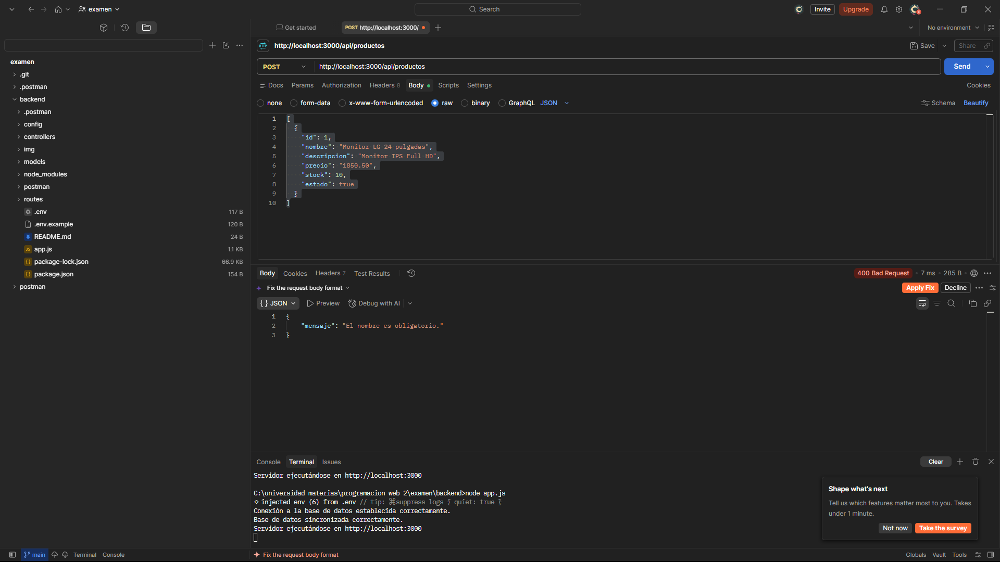
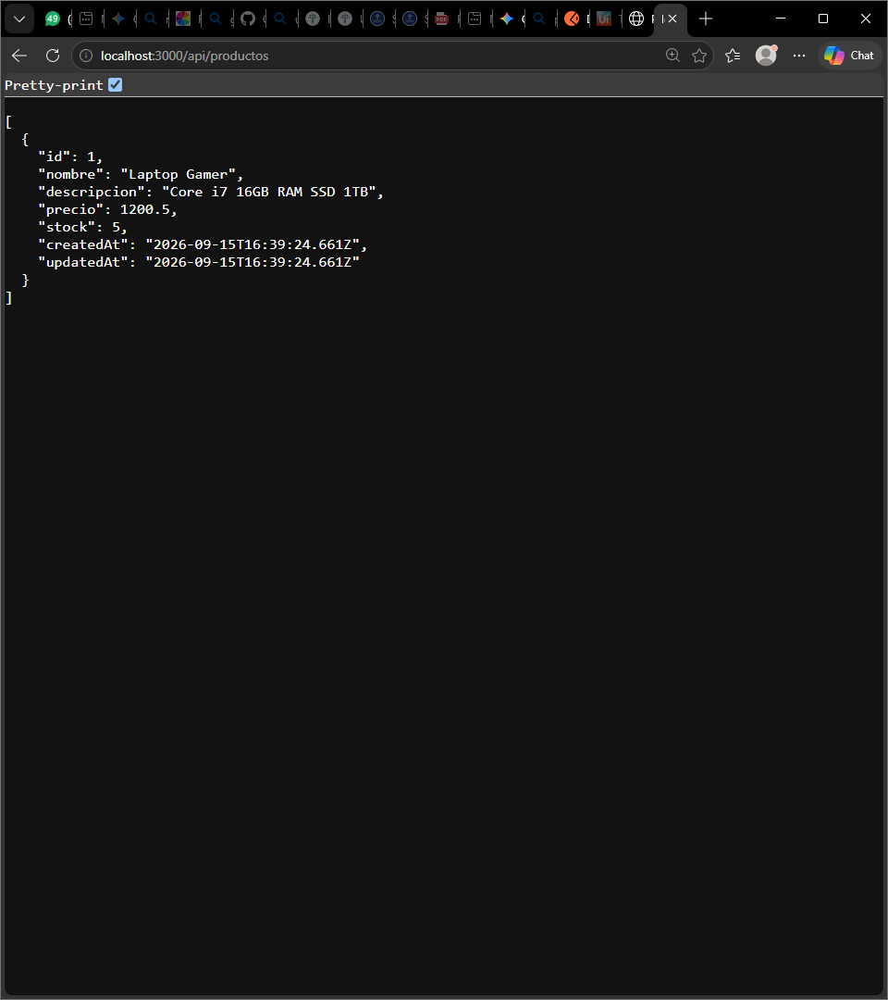
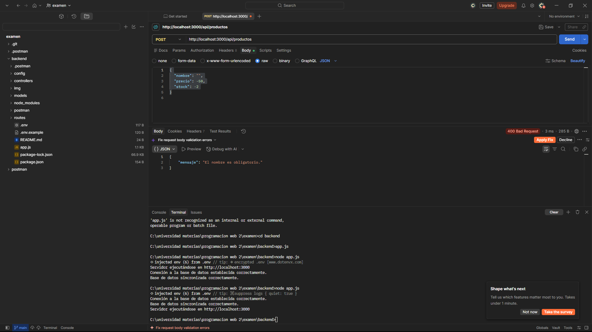

# API REST de Gestión de Productos — Primer Parcial Práctico

* **Estudiantes:** Carlos Ademar Suarez & Adaniel Balderrama
* **Materia:** Programación Web II
* **Carrera:** Ingeniería de Sistemas
* **Institución:** Universidad Privada Domingo Savio (UPDS)

---

## 1. Descripción del Proyecto

API REST modular diseñada para la administración integral de inventario de productos. Desarrollada con **Node.js**, **Express**, **Sequelize** y **Microsoft SQL Server**, siguiendo una arquitectura estructurada bajo el patrón MVC (*Model-View-Controller* / Config, Models, Controllers, Routes). La persistencia de datos es completamente transaccional y persistente en SQL Server, prescindiendo del uso de estructuras volátiles en memoria.

---

## 2. Tecnologías Utilizadas

* **Node.js** — Entorno de ejecución para JavaScript en backend.
* **Express.js** — Framework web para la arquitectura de servicios REST y enrutamiento HTTP.
* **Sequelize** — ORM (*Object-Relational Mapping*) para el modelado y consultas de datos.
* **Tedious & MSSQL** — Drivers de conexión nativos para Microsoft SQL Server.
* **Dotenv** — Gestión y desacoplamiento de variables de entorno sensibles.
* **Postman** — Plataforma para diseño, ejecución y testing de peticiones HTTP.
* **SQL Server Management Studio (SSMS)** — Sistema de gestión de bases de datos relacional.

---

## 3. Estructura del Proyecto

```text
backend/
├── config/
│   └── database.js             # Conexión y configuración de Sequelize con SQL Server
├── controllers/
│   └── productoController.js   # Lógica del negocio para operaciones CRUD
├── img/                        # Evidencias y capturas de funcionamiento
│   ├── basededaatos.png
│   ├── bienvenida.png
│   ├── busquedaennavegador.png
│   ├── conexiondb.png
│   ├── estructura.png
│   ├── fallos.png
│   ├── listarproducto.png
│   └── posman.png
├── models/
│   └── Producto.js             # Definición de la entidad y esquema de tabla
├── routes/
│   └── productoRoutes.js       # Definición de endpoints y métodos HTTP
├── .env                        # Variables de entorno locales (ignorado en Git)
├── .env.example                # Plantilla de variables de entorno requeridas
├── .gitignore                  # Exclusiones de Git (node_modules, .env)
├── app.js                      # Punto de entrada y configuración del servidor Express
├── package.json                # Dependencias y scripts del proyecto
└── README.md                   # Documentación oficial del repositorio
```

---

## 4. Endpoints de la API (CRUD)

| Método | Endpoint | Descripción | Body (JSON) |
| :--- | :--- | :--- | :--- |
| **GET** | `/api/productos` | Obtiene el listado completo de productos | No requerido |
| **POST** | `/api/productos` | Registra un nuevo producto en la BD | `{ "nombre", "descripcion", "precio", "stock" }` |
| **PUT** | `/api/productos/:id` | Actualiza un producto por su ID | Campos a modificar |
| **DELETE**| `/api/productos/:id` | Elimina un producto por su ID | No requerido |

---

## 5. Evidencias de Funcionamiento y Pruebas

A continuación se presentan las capturas organizadas del flujo de desarrollo, configuración y verificación del sistema:

### 5.1. Estructura Arquitectónica y Bienvenida
Muestra de la organización modular del código fuente y confirmación de inicio de la aplicación en el servidor local.

<p align="center">
  
</p>

<p align="center">
  
</p>

---

### 5.2. Conexión y Persistencia en SQL Server
Verificación del enlace exitoso mediante Sequelize y consulta a la tabla `Productos` directamente en SQL Server Management Studio (SSMS).

<p align="center">
  
</p>

<p align="center">
  
</p>

---

### 5.3. Pruebas de Endpoints (Postman y Navegador)
Validación de las operaciones HTTP mediante Postman y consumo directo de los endpoints desde el navegador web.

<p align="center">
  
</p>

<p align="center">
  
</p>

<p align="center">
  
</p>

---

### 5.4. Control y Manejo de Errores
Registro de validaciones y control de excepciones manejadas durante la depuración de conexiones y peticiones incompletas.

<p align="center">
  
</p>

---

## 6. Instrucciones de Instalación y Ejecución Local

1. **Clonar el repositorio:**
   ```bash
   git clone https://github.com/Cars1602/examen1.git
   cd examen1/backend
   ```

2. **Instalar dependencias:**
   ```bash
   npm install
   ```

3. **Configurar variables de entorno:**
   Crear un archivo `.env` basado en `.env.example`:
   ```env
   DB_NAME=WEB2
   DB_USER=sa
   DB_PASSWORD=TuPasswordSeguro
   DB_HOST=localhost
   DB_PORT=1433
   PORT=3000
   ```

4. **Iniciar el servidor:**
   ```bash
   node app.js
